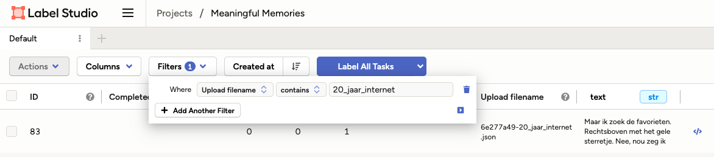
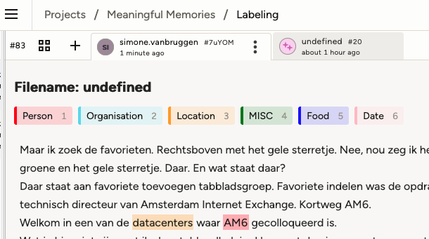
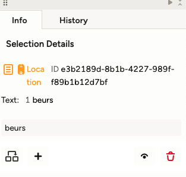
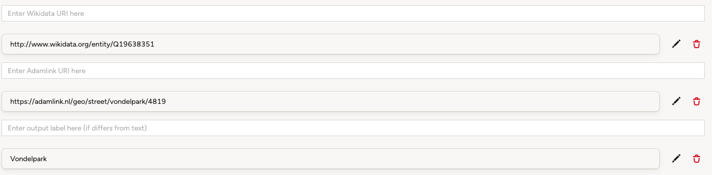
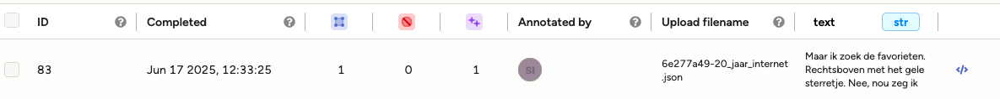

# Text, video and AI

<!-- toc -->

- [Introduction](#introduction)
  * [Data](#data)
  * [Pipeline](#pipeline)
- [Datasprint](#datasprint)
  * [Human evaluation - annotating using LabelStudio](#human-evaluation---annotating-using-labelstudio)
    + [Setting up](#setting-up)
    + [Picking your data](#picking-your-data)
    + [Labelling](#labelling)
  * [Running the pipeline](#running-the-pipeline)
    + [Notebooks](#notebooks)
    + [Running on your own data](#running-on-your-own-data)

<!-- tocstop -->

## Introduction


### Data 
The original videos can be found on: 

https://www.youtube.com/@tvanstegeren 

https://www.youtube.com/@bioamsterdam 

The blogs can be found here:

https://hart.amsterdam/nl/page/392478/biografie-van-amsterdam 


### Pipeline

## Datasprint 
### Human evaluation - annotating using LabelStudio
#### Setting up
1. If you do not yet have a LabelStudio account: create one at https://annotate.laagveen.nl/user/signup/
2. Go to LabelStudio via: https://annotate.laagveen.nl 
3. Go to the Meaningful Memories project: https://annotate.laagveen.nl/projects/3/data


#### Picking your data 
1. Choose an interview of your liking from the [data](#data) section. 
2. Find the interview in LabelStudio in the list, or search it by using a filter: 

Note that files are stored with underscores instead of spaces between words, so use _ instead of spaces in the filter. 
3. Open the file by clicking the row. 

#### Labelling 
1. You should now see the labelling interface:


Please stay within the same tab as was opened (not the one named _undefined_)
2. You can now view the pre-annotated AI annotations. They are colored by type, so red means person, yellow means location etc. 
3. You can update the annotations by:
  - Adding a missing annotation:
    - Select the label type (e.g. Person)
    - Select the correct span in the text by clicking once at the start of the first word and drag the relevant area. 
    - Alternatively, if you only want to annotate a single word: double click on the word. 
  - Removing an incorrect annotation: 
    - Click on the annotation in the text. 
    - Press back space, or
    - Use the bin icon:
    
    
  - Editing an annotation: 
    - Click on the annotation in the text. 
    - Click on a different label type at the top to change it. 
    - If you want to change the span, it is easiest to first remove and then add again.
  - Update linked data:
    - Locations are linked using [AdamLink](https://adamlink.nl/) and [Wikidata](https://www.wikidata.org/). 
    - You can view the links by clicking a location tag and scrolling to the bottom of the file. If a linked location is found, it will be shown here:
    
    - If there are missing links or incorrect ones, please update them by:
      - If necessary, delete the incorrect one
      - Add to the correct field. For Adamlink and Wikidata, please add the full link (so https://adamlink.nl/geo/street/vondelpark/4819, not 4819).
      - The label corresponds to the tagged span. If there are typos in the span, please fill in the corrected form.
4. If you are happy with the annotation, you can save it by pressing Submit at the bottom: 
5. All done! You can see which interviews you annotated in the overview:


### Running the pipeline
If you want to run the pipeline locally, you can do so by using the code in the git (see submodule in this git). We might have to do some adaptations to the config to get it to work locally, so please let me know and we can fix this :) 
#### Notebooks 
You can find an example notebook in the notebooks dir:  ```notebooks/mm_video_example.ipynb```
#### Running on your own data
If you want to run this pipeline on your own data, you can do some by loading the notebook in Google Colab and adding your data folder there (see instructions in notebook). 

